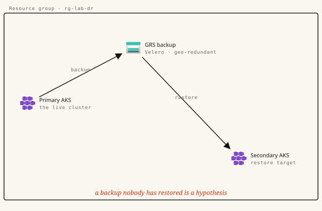

# Prove you can lose a region



**Track:** Reliability · **Level:** Advanced · **Time:** ~50 min · **Cost:** moderate $$ — two AKS clusters + geo-redundant storage; tear down promptly
**Status:** Authored — advanced lab, pending one real end-to-end certification run before publish.
**Full walkthrough (illustrated):** https://azure.campux.co/lab-aks-disaster-recovery

> Run in **Azure Cloud Shell (Bash)** unless noted. This is an advanced lab that provisions real, chargeable resources — **tear down promptly** when done.

## Scenario

A backup you have never restored is a rumour. In this build you run a stateful workload on one AKS cluster, back it up with Velero to geo-redundant storage, then lose the cluster on purpose and bring the data back — byte-for-byte — inside a second cluster in another region. Then you make the whole drill run itself every week, because the DR plan nobody rehearses is the one that fails at 3 a.m.

## Résumé line

*"designed and validated cross-region Kubernetes disaster recovery with automated drills and documented RTO/RPO"*

## Steps

### Setup — Two clusters, matched on purpose

```bash
export MSYS_NO_PATHCONV=1   # Windows/Git Bash: leave resource-id args alone
RG="rg-dr-lab"; PRIMARY="aks-primary"; DR="aks-dr"
az group create -n "$RG" -l eastus

for pair in "$PRIMARY:eastus" "$DR:eastus2"; do
  NAME="${pair%%:*}"; LOC="${pair##*:}"
  az aks create -g "$RG" -n "$NAME" -l "$LOC" \
    --node-count 3 --node-vm-size Standard_D4s_v3 \
    --network-plugin azure --enable-managed-identity \
    --enable-oidc-issuer --zones 1 2 3 --generate-ssh-keys
done

az aks get-credentials -g "$RG" -n "$PRIMARY" --context aks-primary
az aks get-credentials -g "$RG" -n "$DR"      --context aks-dr
kubectl get nodes --context aks-primary
kubectl get nodes --context aks-dr
```

### Step 1 — Geo-redundant storage, and a key that can touch only it

```bash
SA="velerodr$RANDOM"; CONTAINER="velero-backups"
SUB_ID=$(az account show --query id -o tsv)

az storage account create -n "$SA" -g "$RG" -l eastus \
  --sku Standard_GRS --min-tls-version TLS1_2 --allow-blob-public-access false
az storage container create -n "$CONTAINER" --account-name "$SA"

STORAGE_ID=$(az storage account show -n "$SA" -g "$RG" --query id -o tsv)
SP=$(az ad sp create-for-rbac -n velero-sp \
  --role "Storage Blob Data Contributor" --scopes "$STORAGE_ID" --sdk-auth)
CLIENT_ID=$(echo "$SP" | jq -r .clientId)
CLIENT_SECRET=$(echo "$SP" | jq -r .clientSecret)
TENANT_ID=$(echo "$SP" | jq -r .tenantId)
echo "storage: $SA  container: $CONTAINER"
```

### Step 2 — Velero: one writer, one reader

```bash
cat > /tmp/velero-creds.conf <<EOF
AZURE_SUBSCRIPTION_ID=$SUB_ID
AZURE_TENANT_ID=$TENANT_ID
AZURE_CLIENT_ID=$CLIENT_ID
AZURE_CLIENT_SECRET=$CLIENT_SECRET
AZURE_RESOURCE_GROUP=$RG
AZURE_CLOUD_NAME=AzurePublicCloud
EOF

# PRIMARY — read/write backup location + volume snapshots
velero install --provider azure \
  --plugins velero/velero-plugin-for-azure:v1.10.0 \
  --bucket "$CONTAINER" \
  --secret-file /tmp/velero-creds.conf \
  --backup-location-config resourceGroup=$RG,storageAccount=$SA \
  --snapshot-location-config apiTimeout=5m \
  --kubecontext aks-primary

# DR — same bucket, marked read-only (--access-mode ReadOnly)
velero install --provider azure \
  --plugins velero/velero-plugin-for-azure:v1.10.0 \
  --bucket "$CONTAINER" --no-secret \
  --secret-file /tmp/velero-creds.conf \
  --backup-location-config resourceGroup=$RG,storageAccount=$SA \
  --use-volume-snapshots=false \
  --kubecontext aks-dr
velero backup-location set default --access-mode=ReadOnly --kubecontext aks-dr
```

### Step 3 — Stateful data — and a checksum to judge the restore by

```bash
helm repo add bitnami https://charts.bitnami.com/bitnami && helm repo update
kubectl create namespace production --context aks-primary

helm install pg-prod bitnami/postgresql --kube-context aks-primary -n production \
  --set auth.postgresPassword=DrLabP@ss123 \
  --set primary.persistence.enabled=true \
  --set primary.persistence.size=10Gi \
  --set primary.persistence.storageClass=managed-premium
kubectl rollout status statefulset/pg-prod-postgresql -n production --context aks-primary

kubectl exec -i pg-prod-postgresql-0 -n production --context aks-primary -- \
  psql -U postgres -d postgres <<'EOF'
CREATE TABLE customers (id SERIAL PRIMARY KEY, name TEXT, email TEXT UNIQUE, tier TEXT DEFAULT 'standard');
CREATE TABLE orders   (id SERIAL PRIMARY KEY, customer_id INT REFERENCES customers(id), amount NUMERIC(10,2), status TEXT);
INSERT INTO customers (name,email,tier) VALUES
  ('Alice Chen','alice@acme.com','enterprise'),
  ('Bob Martinez','bob@globex.com','standard'),
  ('Carol Johnson','carol@initech.com','enterprise');
INSERT INTO orders (customer_id,amount,status) VALUES
  (1,15000.00,'completed'),(1,8750.50,'processing'),(2,2340.00,'completed'),(3,99999.99,'completed');
SELECT md5(string_agg(id::text||name||email, ',' ORDER BY id)) AS checksum FROM customers;
EOF
```

### Step 4 — Schedule backups — and confirm the disk came too

```bash
velero schedule create hourly-production --schedule="0 * * * *" \
  --include-namespaces production --ttl 48h0m0s --kubecontext aks-primary
velero schedule create daily-production --schedule="0 2 * * *" \
  --include-namespaces production --ttl 720h0m0s --kubecontext aks-primary

velero backup create manual-$(date +%H%M) \
  --include-namespaces production --wait --kubecontext aks-primary
velero backup get --kubecontext aks-primary        # PHASE=Completed, ERRORS=0
velero backup describe <backup-name> --details --kubecontext aks-primary \
  | grep -A3 "Persistent Volumes"                   # must list 1 PV
```

### Step 5 — Lose the cluster. Bring it back in another region.

```bash
# 1 · the disaster
kubectl delete namespace production --context aks-primary

# 2 · restore into the DR cluster from the geo-replicated backup
velero restore create dr-restore --from-backup <backup-name> \
  --kubecontext aks-dr --wait
kubectl rollout status statefulset/pg-prod-postgresql -n production --context aks-dr

# 3 · the verdict — same query, compare to the checksum you saved
kubectl exec -i pg-prod-postgresql-0 -n production --context aks-dr -- \
  psql -U postgres -d postgres -tAc \
  "SELECT md5(string_agg(id::text||name||email, ',' ORDER BY id)) FROM customers;"
```

### Step 6 — Make the drill run itself

```bash
# .github/workflows/dr-drill.yml (essentials)
name: Weekly DR Drill
on:
  schedule: [{ cron: '0 3 * * 0' }]   # Sundays 03:00 UTC
  workflow_dispatch:
jobs:
  drill:
    runs-on: ubuntu-latest
    steps:
      - uses: azure/login@v2
        with: { creds: ${{ secrets.AZURE_CREDENTIALS }} }
      - name: Backup, restore to DR, verify checksum
        run: |
          az aks get-credentials -g "$RG" -n aks-primary --context aks-primary --overwrite-existing
          az aks get-credentials -g "$RG" -n aks-dr      --context aks-dr      --overwrite-existing
          B="dr-drill-$(date +%Y%m%d-%H%M)"
          velero backup create "$B" --include-namespaces production --wait --kubecontext aks-primary
          velero restore create --from-backup "$B" --kubecontext aks-dr --wait
          NEW=$(kubectl exec -i pg-prod-postgresql-0 -n production --context aks-dr -- \
            psql -U postgres -tAc "SELECT md5(string_agg(id::text||name||email, ',' ORDER BY id)) FROM customers;")
          [ "$NEW" = "${{ vars.BASELINE_CHECKSUM }}" ] || { echo "::error::checksum drift"; exit 1; }
```

### Down — Tear it down — this one bills fast

```bash
az group delete -n rg-dr-lab --yes --no-wait
az ad sp delete --id "$CLIENT_ID"        # remove the Velero service principal
az group exists -n rg-dr-lab             # -> false once the async delete finishes
```
