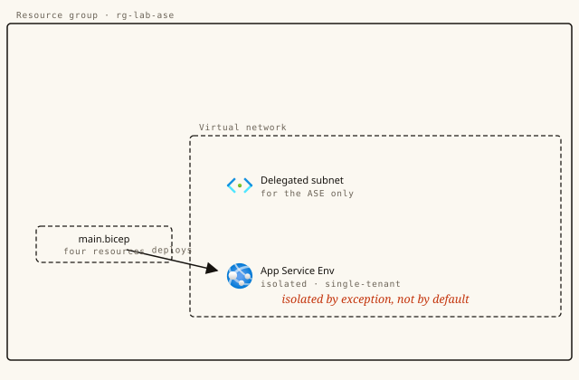

# The isolated tenant: App Service Environment, read as code



**Track:** Compute · **Level:** Advanced · **Time:** ~30 min · **Cost:** free to compile — deploying a real ASE is expensive ($$$); the lab stops at compile
**Status:** Authored — advanced lab, pending one real end-to-end certification run before publish.
**Full walkthrough (illustrated):** https://azure.campux.co/lab-app-service-environment-bicep

> Run in **Azure Cloud Shell (Bash)** unless noted. This is an advanced lab that provisions real, chargeable resources — **tear down promptly** when done.

## Scenario

Regular App Service shares its floor with thousands of other tenants. An App Service Environment gives you the whole building — single-tenant, injected into your own network, private by default. It is also expensive enough that the right way to learn it is to read its Bicep, not run it. So that is what this lab does.

## Résumé line

*"Authored a single-tenant App Service Environment (v3) in Bicep — delegated subnet, IsolatedV2 plan, and app — and can justify when an ASE is warranted versus a private endpoint on a regular Web App"*

## Steps

### Setup — A place to read and compile

```bash
cat > ase.bicep <<'EOF'
// (paste the template from the next section here)
EOF
```

### The template — Four resources make an ASE

```bash
// ase.bicep — App Service Environment v3, read-only reference template.
// Illustrative: read it and compile it; this lab does not deploy it.

@description('Azure region for every resource.')
param location string = resourceGroup().location

@description('Globally unique name stem for the environment.')
param aseName string = 'campux-ase'

@description('Isolated v2 plan size. I1v2 is the smallest; I2v2 / I3v2 scale up.')
@allowed([ 'I1v2', 'I2v2', 'I3v2' ])
param planSku string = 'I1v2'

// 1 · The network. The ASE is injected into ONE subnet, which must be
//     delegated to the App Service platform — that delegation is what lets
//     Azure inject the environment's infrastructure. Nothing else may share
//     this subnet; the environment owns the whole /24.
resource vnet 'Microsoft.Network/virtualNetworks@2023-11-01' = {
  name: '${aseName}-vnet'
  location: location
  properties: {
    addressSpace: { addressPrefixes: [ '10.0.0.0/16' ] }
    subnets: [
      {
        name: 'ase-subnet'
        properties: {
          addressPrefix: '10.0.1.0/24'
          delegations: [
            {
              name: 'Microsoft.Web.hostingEnvironments'
              properties: { serviceName: 'Microsoft.Web/hostingEnvironments' }
            }
          ]
        }
      }
    ]
  }
}

// 2 · The environment. kind 'ASEV3' selects v3 (no stamp fee).
//     internalLoadBalancingMode 3 = fully internal (ILB): apps get PRIVATE
//     IPs only, reachable inside the VNet, never from the public internet.
//     Mode 0 would publish an external VIP instead. Private is the whole
//     point of most ASE deployments.
resource ase 'Microsoft.Web/hostingEnvironments@2024-04-01' = {
  name: aseName
  location: location
  kind: 'ASEV3'
  properties: {
    internalLoadBalancingMode: 3
    virtualNetwork: {
      id: resourceId('Microsoft.Network/virtualNetworks/subnets', vnet.name, 'ase-subnet')
    }
    zoneRedundant: false
  }
}

// 3 · An Isolated v2 App Service plan, placed INSIDE the environment via
//     hostingEnvironmentProfile. This is the only place Isolated v2 SKUs
//     run. You pay the Isolated v2 instance rate — and an empty ASE still
//     bills as one I1v2, which is why this template stays on the page.
resource plan 'Microsoft.Web/serverfarms@2024-04-01' = {
  name: '${aseName}-plan'
  location: location
  sku: {
    name: planSku
    tier: 'IsolatedV2'
  }
  properties: {
    hostingEnvironmentProfile: {
      id: ase.id
    }
  }
}

// 4 · A web app on that plan. Because the plan lives in an internal ASE,
//     this app has no public endpoint — it answers only inside the VNet.
resource site 'Microsoft.Web/sites@2024-04-01' = {
  name: '${aseName}-app'
  location: location
  properties: {
    serverFarmId: plan.id
    hostingEnvironmentProfile: {
      id: ase.id
    }
    httpsOnly: true
  }
}

output aseId string = ase.id
output appPrivateHostName string = site.properties.defaultHostName
```

### Do — Compile it — the free proof it's real

```bash
az bicep build --file ase.bicep --stdout | head -40
# or lint it for style + correctness warnings:
az bicep lint --file ase.bicep
```
