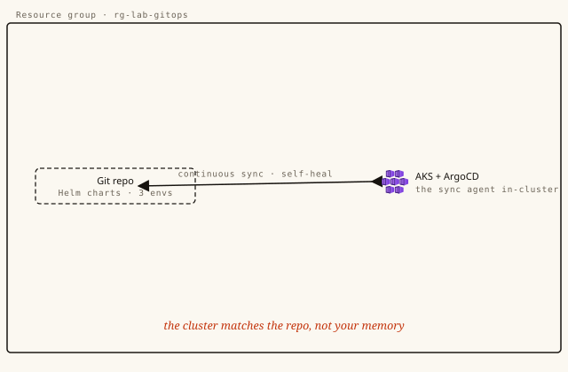

# Deploy by merge, not by hand



**Track:** DevOps · **Level:** Advanced · **Time:** ~45 min · **Cost:** low $ — one AKS cluster; tear down promptly
**Status:** Authored — advanced lab, pending one real end-to-end certification run before publish.
**Full walkthrough (illustrated):** https://azure.campux.co/lab-gitops-argocd

> Run in **Azure Cloud Shell (Bash)** unless noted. This is an advanced lab that provisions real, chargeable resources — **tear down promptly** when done.

## Scenario

In this build the cluster stops taking orders from your laptop and starts taking them from Git. You declare what each environment should look like in a repository; ArgoCD watches that repo and makes the cluster match it — continuously. Promote to production by merging a one-line change, roll back by reverting it, and wire an Azure DevOps pipeline that closes the loop from commit to running pod without anyone touching kubectl apply.

## Résumé line

*"implemented GitOps continuous delivery on Kubernetes with ArgoCD and Azure DevOps"*

## Steps

### Setup — A cluster and a repository

```bash
# Windows/Git Bash: leave resource-id args alone (harmless on macOS/Linux)
export MSYS_NO_PATHCONV=1

RG="campux-gitops-rg"
az group create -n "$RG" -l eastus
az aks create -g "$RG" -n campux-gitops-aks \
  --node-count 2 --node-vm-size Standard_B2s --generate-ssh-keys
az aks get-credentials -g "$RG" -n campux-gitops-aks

# a repo to hold desired state — push an empty one now, fill it in Step 2
git init campux-gitops && cd campux-gitops
git commit --allow-empty -m "root" && git branch -M main
# create it on GitHub/Azure Repos, then: git remote add origin <url> && git push -u origin main
```

### Step 1 — Install ArgoCD, the agent in the cluster

```bash
kubectl create namespace argocd
kubectl apply -n argocd -f https://raw.githubusercontent.com/argoproj/argo-cd/stable/manifests/install.yaml
kubectl rollout status deploy/argocd-server -n argocd

# reach the UI locally (no public LoadBalancer needed for a lab)
kubectl port-forward svc/argocd-server -n argocd 8080:443 &
# initial admin password:
kubectl -n argocd get secret argocd-initial-admin-secret \
  -o jsonpath="{.data.password}" | base64 -d; echo
```

### Step 2 — One Helm chart, three environments

```bash
# repo layout
campux-gitops/
  app/
    Chart.yaml
    values.yaml            # defaults
    values-dev.yaml        # image.tag: dev-latest, replicas: 1
    values-qa.yaml         # image.tag: rc-1.4.0,    replicas: 2
    values-prod.yaml       # image.tag: 1.3.0,       replicas: 3
    templates/deployment.yaml
    templates/service.yaml
```

```bash
# app/values-prod.yaml — the only thing that changes between envs
image:
  repository: mcr.microsoft.com/azuredocs/aks-helloworld
  tag: "v1"
replicaCount: 3
resources:
  requests: { cpu: 50m, memory: 64Mi }
```

### Step 3 — Declare an Application per environment

```bash
kubectl apply -f - <<EOF
apiVersion: argoproj.io/v1alpha1
kind: Application
metadata:
  name: campux-prod
  namespace: argocd
spec:
  project: default
  source:
    repoURL: https://github.com/YOU/campux-gitops.git
    path: app
    targetRevision: main
    helm:
      valueFiles: [values-prod.yaml]
  destination:
    server: https://kubernetes.default.svc
    namespace: prod
  syncPolicy:
    automated: { prune: true, selfHeal: true }
    syncOptions: [CreateNamespace=true]
EOF
```

### Step 4 — Make a bad deploy roll itself back

```bash
# app/templates/deployment.yaml — probes make health real
livenessProbe:  { httpGet: { path: /, port: 80 }, initialDelaySeconds: 5 }
readinessProbe: { httpGet: { path: /, port: 80 }, initialDelaySeconds: 5 }
```

```bash
# prove the old pods still serve while the bad one never goes Ready
kubectl get rs -n prod
argocd app rollback campux-prod   # or: git revert the bad commit — the GitOps way
```

### Step 5 — Close the loop with Azure DevOps

```bash
# azure-pipelines.yml (essentials)
trigger: { branches: { include: [main] } }
pool: { vmImage: ubuntu-latest }
steps:
  - task: Docker@2
    inputs: { command: buildAndPush, repository: campux/app, tags: "$(Build.BuildId)" }
  - script: |
      TAG=$(Build.BuildId)
      yq -i ".image.tag = \"$TAG\"" app/values-dev.yaml
      git config user.email ci@campux.co && git config user.name "Azure DevOps"
      git commit -am "ci: dev image $TAG" && git push origin HEAD:main
    displayName: "Bump dev tag → let ArgoCD sync"
```

### Down — Tear it down

```bash
az group delete -n campux-gitops-rg --yes --no-wait
az group exists -n campux-gitops-rg      # -> false once the async delete finishes
```
