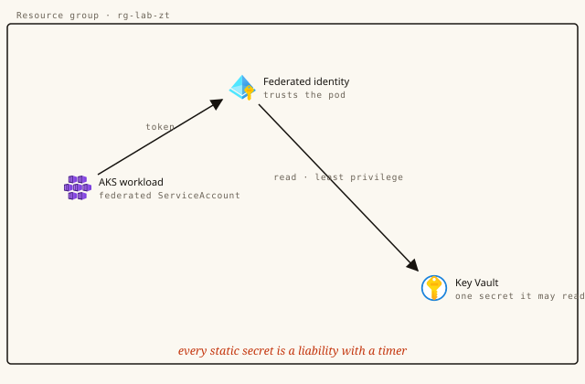

# A workload with no secrets to steal



**Track:** Security · **Level:** Advanced · **Time:** ~40 min · **Cost:** low $ — one real AKS cluster; tear down promptly
**Status:** Authored — advanced lab, pending one real end-to-end certification run before publish.
**Full walkthrough (illustrated):** https://azure.campux.co/lab-zero-trust-aks

> Run in **Azure Cloud Shell (Bash)** unless noted. This is an advanced lab that provisions real, chargeable resources — **tear down promptly** when done.

## Scenario

The fastest way to leak a credential is to have one. In this build you run a real application on AKS that holds no password, no connection string, no key of its own — it proves who it is to Azure with a federated token, reads what it needs from Key Vault just-in-time, and sits inside a namespace that denies every packet it did not explicitly invite. This is what "zero trust" means once you stop saying it and start deploying it.

## Résumé line

*"implemented zero-trust workload identity and network segmentation on Kubernetes"*

## Steps

### Setup — A cluster that can issue tokens

```bash
# Windows/Git Bash: stop it mangling resource-id arguments (harmless on macOS/Linux)
export MSYS_NO_PATHCONV=1

RG="campux-zt-rg"
az group create -n "$RG" -l eastus

az aks create -g "$RG" -n campux-zt-aks \
  --node-count 2 --node-vm-size Standard_B2s \
  --enable-oidc-issuer --enable-workload-identity \
  --network-plugin azure --network-policy azure \
  --generate-ssh-keys

az aks get-credentials -g "$RG" -n campux-zt-aks
kubectl create namespace production

# capture the two values federation needs
export OIDC_ISSUER=$(az aks show -g "$RG" -n campux-zt-aks --query "oidcIssuerProfile.issuerUrl" -o tsv)
export TENANT_ID=$(az account show --query tenantId -o tsv)
echo "issuer: $OIDC_ISSUER"
```

### Step 1 — An identity, and a secret only it may read

```bash
az identity create -g "$RG" -n app-workload-id
export CLIENT_ID=$(az identity show -g "$RG" -n app-workload-id --query clientId -o tsv)

az keyvault create -g "$RG" -n kv-campux-zt --enable-rbac-authorization false
az keyvault secret set --vault-name kv-campux-zt --name db-password --value "SecureP@ssword123"

# the identity may read secrets — get/list only
az keyvault set-policy -n kv-campux-zt --spn "$CLIENT_ID" --secret-permissions get list
```

### Step 2 — Federate the ServiceAccount

```bash
kubectl apply -f - <<EOF
apiVersion: v1
kind: ServiceAccount
metadata:
  name: app-sa
  namespace: production
  annotations:
    azure.workload.identity/client-id: "$CLIENT_ID"
EOF

az identity federated-credential create \
  --name app-fed-credential \
  --identity-name app-workload-id \
  --resource-group "$RG" \
  --issuer "$OIDC_ISSUER" \
  --subject "system:serviceaccount:production:app-sa"
```

### Step 3 — Deploy the workload — watch it read a secret it never stored

```bash
kubectl apply -f - <<EOF
apiVersion: apps/v1
kind: Deployment
metadata:
  name: secure-app
  namespace: production
spec:
  replicas: 1
  selector:
    matchLabels: { app: secure-app }
  template:
    metadata:
      labels:
        app: secure-app
        azure.workload.identity/use: "true"
    spec:
      serviceAccountName: app-sa
      containers:
      - name: app
        image: mcr.microsoft.com/azure-cli:latest
        command: ["/bin/sh","-c","az login --identity && az keyvault secret show --vault-name kv-campux-zt --name db-password --query value -o tsv && sleep 3600"]
EOF

# the secret value should appear in the logs — fetched with no stored credential
kubectl logs -n production deploy/secure-app
```

### Step 4 — Default-deny the network, then allow exactly one path

```bash
# deny all ingress and egress in the namespace, then allow frontend -> backend:3000 only
kubectl apply -f - <<EOF
apiVersion: networking.k8s.io/v1
kind: NetworkPolicy
metadata:
  name: default-deny-all
  namespace: production
spec:
  podSelector: {}
  policyTypes: [Ingress, Egress]
---
apiVersion: networking.k8s.io/v1
kind: NetworkPolicy
metadata:
  name: allow-frontend-to-backend
  namespace: production
spec:
  podSelector:
    matchLabels: { app: backend }
  ingress:
  - from:
    - podSelector:
        matchLabels: { app: frontend }
    ports:
    - port: 3000
EOF
```

```bash
kubectl run probe -n production --image=busybox --restart=Never -- \
  sh -c "wget -T 5 -qO- backend:3000 || echo BLOCKED"
kubectl logs -n production probe   # -> BLOCKED (timed out, as designed)
```

### Down — Tear it down

```bash
az group delete -n campux-zt-rg --yes --no-wait
az group exists -n campux-zt-rg      # -> false, once the async delete completes
```
